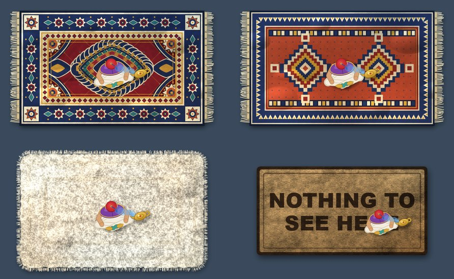
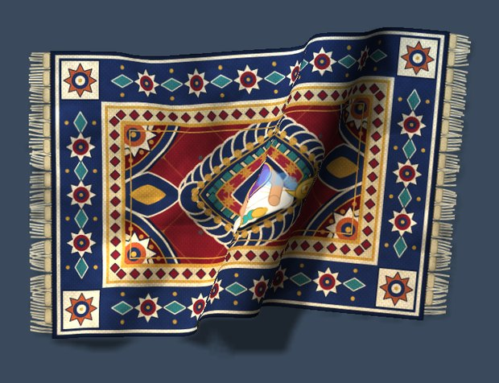
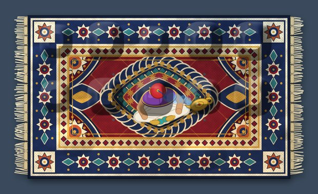

# AladdinRug

AladdinRug (shown in the app as "Aladdin Rug") is a rug for your Windows desktop. It lies over your icons the way a rug
hides what's been swept under it, and it behaves like a real one: heavy cloth you take hold of with a hand cursor, lift,
drag, fold a corner over and roll up. A little rug merchant walks in to roll it up and out. He can also sort the loose
files on your desktop into folders and sweep the folders under the rug. And a tiny Aladdin sits on it.



## Requirements

- Windows 10 or 11 (x64)
- [.NET 8 Desktop Runtime](https://dotnet.microsoft.com/download/dotnet/8.0) to run it, or the .NET 8 SDK (or newer) to build it

## Build and run

```bash
git clone <repository-url> AladdinRug
cd AladdinRug
```

```bash
dotnet publish src/AladdinRug/AladdinRug.csproj -c Release -r win-x64 --self-contained false -p:PublishSingleFile=true -o dist
```

Then run `dist\AladdinRug.exe`. One rug appears on each monitor, and a rug icon appears in the system tray.
Starting the exe again while it runs rolls the rug up or out instead of opening a second copy.

To work on it, open `AladdinRug.sln` in Visual Studio 2022 (or use `dotnet build AladdinRug.sln`).

## Using it

| To | Do this |
| --- | --- |
| Take hold of the rug | Press **anywhere** on it. The pointer becomes a hand that takes a handful of rug |
| Drag it, bunch it, fold it over | Keep holding and move. Pull it along and it slides; push part of it back over itself and it folds, showing its underside |
| Let go | It drops (with a puff of dust if an edge slaps down) and stays exactly as it lands |
| Roll it up / out | Double-click it, press **Ctrl+Alt+R**, or click the tray icon. A rolled rug stays on the desktop, tied with two straps; click the roll to unroll it, drag it to move it |
| Hide icons under it | Drag an icon (or a whole selection) and drop it on the rug: the drop goes through to the desktop, so the icon simply stays there, hidden |
| Change the rug | Right-click the rug or tray icon, **Rug style**: Persian (heavy wool), Kilim (thin, floppy), Shaggy (deep pile, grippy) or Doormat (small, stiff, "NOTHING TO SEE HERE"). Each has its own weight and stiffness |
| Aladdin | **Aladdin on the rug** puts a small Aladdin on it, sitting cross-legged with his lamp. He's part of the rug's picture, so he moves and folds with it |
| The merchant | **A merchant rolls the rug**: he walks in, crouches at the end of the rug and pushes the roll along, ties the straps, claps the dust off and leaves. Press the shortcut again to skip to the end; turn it off for a quick roll |
| Sort the desktop | **Merchant: sort the desktop files into folders**. After you confirm, he makes a folder per file type ("PDF files", "Shortcuts"... a type with only one file goes into "Other files") and carries the loose files into them, one to five at a time. Choose it again to make him finish at once |
| Sweep the folders under the rug | **Broom: sweep the icons under the rug**. He pushes each desktop *folder* across the desktop with a broom until it slides under the rug, and the rug looks lumpy where they lie |
| Undo | **Undo: put the sorted files back** and **Pull everything out from under the rug** |
| Every start | **Sort the desktop when the rug starts**: once the rug is out, the merchant sorts the loose files into folders. Asked once on first start. Only sorting happens by default; **...and then sweep the folders under the rug** adds the sweep and is off until you switch it on |
| Quit | **Take the rug away**. Whatever was swept under the rug comes back out |






### What it does to your files, and how to get everything back

Rolling, folding, Aladdin and the styles never touch your desktop. Two features do, and both can be undone:

- **Sorting moves real files** from your Desktop folder into new folders on the desktop. Nothing is deleted or
  overwritten: a name clash gets a new name like `report (2).pdf`. Your existing folders, hidden files and system files
  are left alone, and the shared Public Desktop is never touched. Every move is written to an undo list, and
  **Undo** moves each file back and removes the folders it made, but only if they are empty.
- **Sweeping changes icon positions only**, never files. It needs *Auto arrange icons* switched off (right-click the
  desktop, View). Windows allows one icon per grid cell, so each folder takes a free spot under the rug or swaps places
  with an icon already hidden there. A copy of the whole layout is saved before every sweep. **Pull everything out**
  (and quitting) puts every icon back where it was.

If the rug isn't running, these still work from a command prompt:

```bash
AladdinRug.exe --untidy
```

```bash
AladdinRug.exe --pullout
```

### Settings and files

| File | What it holds |
| --- | --- |
| `%APPDATA%\AladdinRug\settings.txt` | `style`, `aladdin`, `roller` (the merchant rolls the rug), `autotidy` (sort at start), `autosweep` (sweep at start; off by default) |
| `%APPDATA%\AladdinRug\positions.txt` | Where each monitor's rug lies and whether it's rolled. Delete it to put the rugs back in the middle |
| `%APPDATA%\AladdinRug\organized.txt` | The undo list for sorting |
| `%APPDATA%\AladdinRug\swept.txt` | What is under the rug, and where each icon was |
| `%APPDATA%\AladdinRug\layout-backup.txt` | Every icon's position, saved before the last sweep |
| `%LOCALAPPDATA%\AladdinRug\log.txt` | The log |

**Start with Windows** in the tray menu adds the exe to `HKCU\...\Run`.

### Upgrading from an older name

This project used to be called *DesktopRug*, then *AlaaddinRug*. The first time AladdinRug runs it moves the old
`%APPDATA%` and `%LOCALAPPDATA%` folders (settings, where the rug lies, the undo lists, the log) to the new names, and
re-makes a "Start with Windows" entry under the new name, so nothing is lost. Close the old copy first, and delete the old
folder it was built in once you've moved to the new one.

## How it works

- **The window**: each rug is a transparent WPF window kept directly above the desktop window in the stacking order,
  so it covers the wallpaper and icons while every app window and the taskbar stay on top. It never takes focus, and
  its transparent pixels let clicks through. While a drag that started elsewhere is under way, the whole window turns
  click-through, so icons can be dropped "under" it.
- **The cloth** (`Cloth/Cloth.cs`): about 500–1,900 points (depending on monitor size) joined by springs, simulated
  with position-based dynamics (3 sub-steps × 6 iterations, 60 steps a second). The threads are held to 2.5% stretch
  and the weave resists shearing, so the rug stays a rug. It lies on a floor with friction, layers stack when it
  folds, and the hand lifts a handful low (to drag) or high (to fold) depending on which way you move. Nothing is
  scripted: the bunching and folds come from the physics.
- **Drawing** (`Cloth/ClothRenderer.cs`): the points are smoothed into a finer surface and drawn as lit, textured
  triangles on the CPU, in parallel, with a depth test, the underside on folded parts, and soft shadows from the rug's
  height. Physics, drawing and putting pixels on screen run on three threads (`Cloth/ClothEngine.cs`). A rug lying
  flat is just a picture: no simulation runs until you pick it up.
- **The art** (`Rug/RugArt*.cs`) is all procedural: vector designs plus a pixel pass for weave, uneven dye, folds and
  lumps. There are no image files.
- **The merchant** (`Merchant/`): drawn from above in code (`Merchant.cs`), moved by `MerchantMotion.cs`. He
  accelerates, turns on the spot and his steps match the ground he covers. He lives in a small click-through window
  stacked just above the rug. Slow work (moving files, asking Explorer about icons) runs on a worker thread so he
  never stutters. The desktop's icons are read and moved through Explorer's list view (`DesktopIcons.cs`).

### Project layout

```
src/AladdinRug/
  App/        start-up, tray menu, settings, the set of rugs (one per monitor)
  Rug/        the rug window, its art, dust, cursors, the lumps of what's under it
  Cloth/      physics, drawing, and the threads that run them
  Merchant/   the merchant: art, motion, rolling, sorting files, sweeping folders
  Platform/   Win32 calls
  Dev/        developer modes (pictures and measurements, see below)
tools/SimTest/  console harness for the physics and the file sorter
docs/images/    pictures for this page
```

## Developer tools

The app has picture modes that never touch your real rug or desktop:

```bash
AladdinRug.exe [--style kilim] --preview flat|roll|rollmid|hold|stuffed out.png
AladdinRug.exe --sequence up|out out-folder
AladdinRug.exe --merchant out.png
AladdinRug.exe --simtest out-folder [middle|tent|corner|edge|drag]
AladdinRug.exe --selftest report.txt
```

`--sequence` shows the merchant rolling the rug frame by frame, and `--merchant` draws a sheet of his poses.
`--selftest` puts a temporary rug on the desktop for a few seconds and writes how smoothly it ran.

`tools/SimTest` checks things without a desktop:

```bash
dotnet run --project tools/SimTest -c Release -- organize %TEMP%\rugtest
```

```bash
dotnet run --project tools/SimTest -c Release -- stress %TEMP%\rugstress
```

```bash
dotnet run --project tools/SimTest -c Release -- bench
```

- `organize` sorts and un-sorts made-up files in a scratch folder and checks the result. Its exit code is the number of failures.
- `stress` runs wild gestures and reports cracks, stretch, shear and folds, and saves contact sheets.
- `bench` times a dragging frame.
- `scenes` and `dust` save pictures.

To try sorting and sweeping on the real desktop without touching your own files, put a few throwaway files on the
desktop with an unusual extension (say `zz_test_1.rugA`, `zz_test_2.rugA`, `zz_test_3.rugB`, `zz_test_4.rugB`) and start the
app with these two set:

```bash
set RUG_ORGANIZE_ONLY=zz_test_
set RUG_SWEEP_ONLY=RUG
```

The sorter then only moves files whose names start with `zz_test_`. It puts them into "RUGA files" and "RUGB files".
The broom then only sweeps folders whose names start with `RUG`.

## License

[MIT](LICENSE)
